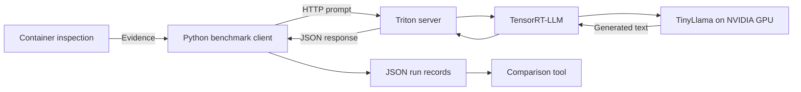

# TurboServe

**Local LLM serving and evidence-based performance analysis on an 8 GB GPU.**

TurboServe runs TinyLlama through PyTorch, NVIDIA TensorRT-LLM, and Triton
Inference Server. It records request timings alongside container and model
configuration evidence, then checks whether saved runs have matching settings.
The goal is to understand inference performance and demonstrate improvements
through reproducible experiments.

**Status:** serving is verified; benchmarking is in progress. This is a portfolio
engineering project, not a production deployment or completed performance study.

## Capabilities

- Standalone PyTorch and TensorRT-LLM inference.
- Local Triton HTTP serving with a pinned image and model snapshot.
- Bounded concurrent benchmarks with full-response latency and server-side TTFT.
- JSON records with responses, timings, and container configuration evidence.
- Comparison checks for missing, stale, or different recorded settings.
- Offline tests for measurement accounting and evidence validation.
- Optional device-wide GPU telemetry alongside measured requests.

## Architecture



The server keeps the model loaded between requests. The benchmark checks container
evidence before and after measurement. Comparisons read saved records; they do
not invoke a model or establish the cause of a timing change.

## Requirements and setup

Verified on Windows 11, Ubuntu 24.04 under WSL2, an RTX 3060 Ti (8 GB), Docker
Engine, NVIDIA Container Toolkit, and Python 3.12. Other environments have not
been validated. Benchmark clients use Python's standard library.

For a fresh machine, follow the [environment assessment](docs/milestone-1-environment.md)
and [Triton setup notes](docs/milestone-4-triton-serving.md). Setup scripts install
system packages and configure Docker; review them before execution.

The launcher requires NVIDIA's TensorRT-LLM `v1.2.1` template checkout and the
cached snapshot specified in [the model configuration](configs/triton-model.yaml).
It checks for these files; it does not download missing weights.

Default paths are `TensorRT-LLM-v1.2.1` alongside this repository and the current
Ubuntu user's `~/.cache/huggingface`. Override them in Ubuntu if needed:

```bash
export TURBOSERVE_TRTLLM_SOURCE=/absolute/path/to/TensorRT-LLM-v1.2.1
export TURBOSERVE_HF_CACHE=/absolute/path/to/huggingface
```

## Quick start

Run from the repository root **inside Ubuntu**, after completing setup.
From PowerShell, enter Ubuntu with `wsl -d Ubuntu-24.04` first.

Terminal 1 — start the server and wait for `READY`:

```bash
bash scripts/start-triton-wsl.sh
```

Terminal 2 — check generation, then benchmark:

```bash
bash scripts/test-triton-wsl.sh
bash scripts/benchmark-with-runtime-wsl.sh
```

For diagnostic GPU sampling during a longer run:

```bash
bash scripts/benchmark-with-runtime-wsl.sh --gpu-telemetry --requests 20
```

Sampling records utilization, clocks, memory, temperature, power and performance
state. It adds overhead and includes other GPU applications; compare runs with
matching telemetry settings.

The default benchmark excludes one warmup and measures five sequential requests.
Records are saved in Git-ignored `results/`. They include prompts and responses;
review before sharing. Press Ctrl+C in Terminal 1 to stop the server. HTTP, gRPC
and metrics ports are published on loopback only.

Compare two records and run offline tests:

```bash
python3 scripts/compare_runs.py results/FIRST.json results/SECOND.json
python3 -m unittest discover -s scripts -p 'test_*.py'
```

To summarize one saved run as Markdown without starting the server:

```bash
python3 scripts/report_run.py results/RUN.json
```

The report recalculates latency statistics, counts valid server TTFT samples,
checks recorded runtime evidence, and summarizes GPU observations per device.
Missing measurements remain unavailable; the report does not infer speedups.

Replace the example filenames with actual records. Tests do not require a GPU
server. Standalone inference runners are documented in the milestone guides.

## Measurement evidence

Two independent five-request runs with matching recorded settings produced:

| Run (UTC, September 10) | Median HTTP completion | Median server TTFT |
| --- | ---: | ---: |
| 03:05 | 199.46 ms | 18.42 ms |
| 03:46 | 631.64 ms | 30.81 ms |

This variation is unresolved, not a demonstrated speedup or causal regression.
Those runs did not sample GPU utilization, clocks, temperature, or competing
workload. See the [benchmark methodology](docs/milestone-5-benchmarking.md) for
identifiers, conditions, and limitations.

Server TTFT measures executor arrival to first-token generation. Client-observed
streaming TTFT, actual output-token accounting, controlled cross-backend
comparisons, and concurrency tests remain unfinished. Matching recorded settings
does not prove identical loaded tensors or system load.

The selected configuration pins float16, a cached model snapshot, and a KV-cache
budget. The temporary container installs a pinned SDK correction at startup,
requiring network access. There is no authentication or web chat interface.

## Project guide

| Location | Purpose |
| --- | --- |
| `src/turboserve/` | Standalone inference runners |
| `configs/` | Server model configuration |
| `scripts/` | Setup, serving, measurements, comparisons and tests |
| `docs/` | Decisions, verified evidence and limitations |

1. [Environment assessment](docs/milestone-1-environment.md)
2. [PyTorch baseline](docs/milestone-2-pytorch-baseline.md)
3. [TensorRT-LLM path](docs/milestone-3-tensorrt-llm.md)
4. [Triton serving](docs/milestone-4-triton-serving.md)
5. [Benchmarking — in progress](docs/milestone-5-benchmarking.md)

Next: strengthen workload controls and add actual output-token accounting.
A later AI investigation assistant will use validated
comparison tools to explain evidence. MCP and agent integration are planned,
not implemented.

Concurrency support passed offline tests and two live 1-versus-2 experimental pairs.
Use `--concurrency 2 --requests 20` with the benchmark wrapper to allow up to two
active requests. Collect a fresh `--concurrency 1` run with the same settings
first. Request throughput is completed requests divided by the measured batch
wall time, not tokens per second.
